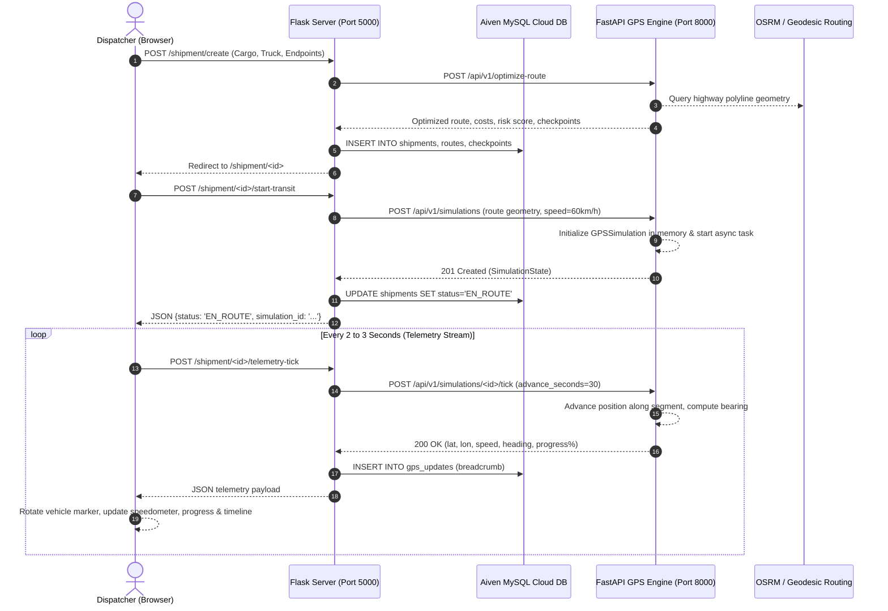

# SupplyNet GPS Simulation Engine & Telematics Architecture

> **Comprehensive Technical Guide** for the FastAPI Real-World GPS Telematics Simulator (`main3.py`), mathematical physics engine, telematics synchronization pipeline, and Flask Shipment Blueprint integration (`sn_app/blueprints/shipment/routes.py`).

---

## Table of Contents
1. [Executive Summary & Purpose](#1-executive-summary--purpose)
2. [Why Simulated GPS is Essential for SupplyNet](#2-why-simulated-gps-is-essential-for-supplynet)
3. [System Architecture & Communication Flow](#3-system-architecture--communication-flow)
4. [Mathematical Physics & Geodesic Equations](#4-mathematical-physics--geodesic-equations)
   - [Great-Circle Distance (Haversine Formula)](#great-circle-distance-haversine-formula)
   - [Initial Bearing / Forward Azimuth](#initial-bearing--forward-azimuth)
   - [Segment Advancement & Spatial Interpolation](#segment-advancement--spatial-interpolation)
5. [FastAPI Simulation Server Internals (`main3.py`)](#5-fastapi-simulation-server-internals-main3py)
   - [The `GPSSimulation` Class Lifecycle](#the-gpssimulation-class-lifecycle)
   - [Concurrency & Thread Safety](#concurrency--thread-safety)
   - [Memory Leak Prevention](#memory-leak-prevention)
   - [Multi-Key Lookup & Crash Recovery](#multi-key-lookup--crash-recovery)
   - [Atomic Route Persistence (`RouteStore`)](#atomic-route-persistence-routestore)
6. [Complete REST API Reference](#6-complete-rest-api-reference)
   - [`POST /api/v1/optimize-route`](#post-apiv1optimize-route)
   - [`POST /api/v1/simulations`](#post-apiv1simulations)
   - [`POST /api/v1/simulations/{id}/tick`](#post-apiv1simulationsidtick)
   - [`GET /api/v1/simulations/{id}`](#get-apiv1simulationsid)
   - [`POST /api/v1/simulations/{id}/pause`](#post-apiv1simulationsidpause)
   - [`POST /api/v1/simulations/{id}/resume`](#post-apiv1simulationsidresume)
   - [`POST /api/v1/simulations/{id}/stop`](#post-apiv1simulationsidstop)
   - [`GET /api/v1/simulations/{id}/history`](#get-apiv1simulationsidhistory)
   - [`POST /api/v1/routes/register`](#post-apiv1routesregister)
7. [Flask Integration & Shipment Routes (`routes.py`)](#7-flask-integration--shipment-routes-routespy)
   - [Function-by-Function Breakdown](#function-by-function-breakdown)
   - [Telemetry Polling Cycle](#telemetry-polling-cycle)
8. [Database Model Alignment](#8-database-model-alignment)
9. [Frontend Live Telematics UI (`shipment_detail.html`)](#9-frontend-live-telematics-ui-shipment_detailhtml)
10. [Configuration & Switching Environments](#10-configuration--switching-environments)

---

## 1. Executive Summary & Purpose

SupplyNet is a multi-modal freight logistics platform requiring live truck telematics tracking, ETA calculation, carbon footprint tracking, and corridor checkpoint detection.

The **FastAPI GPS Simulation Engine** (`main3.py`) acts as a realistic virtual GPS hardware tracker (equivalent to an onboard Teltonika, CalAmp, or Queclink vehicle telematics box). It simulates a commercial heavy goods vehicle (HGV) driving along real-world highway coordinates in India (e.g., the 1,860 km Chandigarh $\to$ Delhi $\to$ Agra $\to$ Nagpur $\to$ Visakhapatnam corridor) with high-fidelity geodesic physics.

---

## 2. Why Simulated GPS is Essential for SupplyNet

Real-world telematics hardware streams NMEA-0183 or binary AVL data over cellular networks (GPRS/LTE). Testing logistics software with physical trucks has major friction points:
1. **Physical Constraint**: Testing cross-country routes would take 36–48 hours per test cycle.
2. **Deterministic Validation**: Developers need to reproduce corner cases (rerouting, corridor deviation, sudden stops, waypoint passing, server reboots) on demand.
3. **Speed Multipliers**: The engine allows controllable simulation speeds (`1x`, `2x`, `5x`, `10x`, `20x`) or discrete step ticks (`advance_seconds=30s`) so a multi-day trip can be tracked smoothly within minutes.

---

## 3. System Architecture & Communication Flow



---

## 4. Mathematical Physics & Geodesic Equations

The engine does not jump between arbitrary points; it moves the vehicle along true spherical arcs according to Newtonian kinematics and geodesy.

### Great-Circle Distance (Haversine Formula)

The distance between any two geographical coordinates $P_1(\phi_1, \lambda_1)$ and $P_2(\phi_2, \lambda_2)$ on Earth (where radius $R = 6,371.0\text{ km}$) is calculated using the Haversine equation:

$$\Delta\phi = \phi_2 - \phi_1, \quad \Delta\lambda = \lambda_2 - \lambda_1$$

$$a = \sin^2\left(\frac{\Delta\phi}{2}\right) + \cos(\phi_1)\cos(\phi_2)\sin^2\left(\frac{\Delta\lambda}{2}\right)$$

$$c = 2 \cdot \operatorname{atan2}\left(\sqrt{a}, \sqrt{1 - a}\right)$$

$$d = R \cdot c$$

In `main3.py`:
```python
def calculate_haversine_distance(lat1: float, lon1: float, lat2: float, lon2: float) -> float:
    R = 6371.0  # Earth radius in km
    dlat = math.radians(lat2 - lat1)
    dlon = math.radians(lon2 - lon1)
    a = math.sin(dlat / 2)**2 + math.cos(math.radians(lat1)) * math.cos(math.radians(lat2)) * math.sin(dlon / 2)**2
    c = 2 * math.atan2(math.sqrt(a), math.sqrt(1 - a))
    return R * c
```

---

### Initial Bearing / Forward Azimuth

To orient the truck marker on Google Maps and Leaflet in the exact direction of travel ($0^\circ = \text{North}, 90^\circ = \text{East}, 180^\circ = \text{South}, 270^\circ = \text{West}$), the engine computes the forward azimuth from the current position to the next waypoint:

$$y = \sin(\Delta\lambda) \cdot \cos(\phi_2)$$

$$x = \cos(\phi_1)\sin(\phi_2) - \sin(\phi_1)\cos(\phi_2)\cos(\Delta\lambda)$$

$$\theta = \left(\operatorname{atan2}(y, x) \cdot \frac{180}{\pi} + 360\right) \pmod{360}$$

In `main3.py`:
```python
def _calculate_bearing(p1: RoutePoint, p2: RoutePoint) -> float:
    lat1, lon1 = math.radians(p1.lat), math.radians(p1.lon)
    lat2, lon2 = math.radians(p2.lat), math.radians(p2.lon)
    dlon = lon2 - lon1
    y = math.sin(dlon) * math.cos(lat2)
    x = math.cos(lat1) * math.sin(lat2) - math.sin(lat1) * math.cos(lat2) * math.cos(dlon)
    bearing = (math.degrees(math.atan2(y, x)) + 360) % 360
    return round(bearing, 2)
```

---

### Segment Advancement & Spatial Interpolation

When time advances by $\Delta t$ seconds at speed $v\text{ km/h}$, the physical distance traversed is:

$$\Delta d = \frac{v \cdot \Delta t}{3,600}\text{ km}$$

If the remaining length of the current segment is less than $\Delta d$, the vehicle transitions to the next segment:

```python
def _advance_position(self, seconds: float) -> None:
    remaining_km = self.speed_kmh * seconds / 3600
    while remaining_km > 1e-9 and self.segment_index < len(self.segment_distances):
        segment_km = self.segment_distances[self.segment_index]
        available_km = segment_km - self.segment_progress_km
        step_km = min(remaining_km, available_km)
        self.segment_progress_km += step_km
        self.travelled_km += step_km
        remaining_km -= step_km
        if self.segment_progress_km >= segment_km - 1e-9:
            self.segment_index += 1
            self.segment_progress_km = 0.0
```

Once the active segment is identified, the exact coordinates are linearly interpolated using ratio $r = \frac{\text{segment\_progress\_km}}{\text{segment\_length}}$:

$$\text{lat} = \text{lat}_{\text{start}} + (\text{lat}_{\text{end}} - \text{lat}_{\text{start}}) \cdot r$$

$$\text{lon} = \text{lon}_{\text{start}} + (\text{lon}_{\text{end}} - \text{lon}_{\text{start}}) \cdot r$$

$$\text{alt} = \text{alt}_{\text{start}} + (\text{alt}_{\text{end}} - \text{alt}_{\text{start}}) \cdot r$$

```python
start, end = self.points[self.segment_index : self.segment_index + 2]
self.heading = _calculate_bearing(start, end)
ratio = self.segment_progress_km / max(self.segment_distances[self.segment_index], 1e-9)

self.current = RoutePoint(
    lat=round(start.lat + (end.lat - start.lat) * ratio, 7),
    lon=round(start.lon + (end.lon - start.lon) * ratio, 7),
    altitude_m=altitude,
)
```

---

## 5. FastAPI Simulation Server Internals (`main3.py`)

### The `GPSSimulation` Class Lifecycle

1. **Instantiation**: Takes vehicle ID, route points, speed, and reporting interval. Precomputes all segment distances and sets initial bearing.
2. **Execution Modes**:
   - **Continuous Mode**: Background `asyncio.Task` advances the position every `interval_seconds`.
   - **Discrete Tick Mode**: The client or Flask server triggers `POST /tick` with arbitrary `advance_seconds`.
3. **State Transitions**:
   $$\text{CREATED} \longrightarrow \text{EN\_ROUTE} \underset{\text{Resume}}{\overset{\text{Pause}}{\rightleftharpoons}} \text{PAUSED} \longrightarrow \text{COMPLETED} / \text{STOPPED}$$

---

### Concurrency & Thread Safety

FastAPI runs an asynchronous event loop. Because multiple clients can poll telemetry simultaneously while a background task runs, the `GPSSimulation` instance wraps position mutations in an `asyncio.Lock`:

```python
async def advance(self, seconds: float) -> None:
    async with self.lock:
        if self.status in {"STOPPED", "COMPLETED"}:
            return
        self._advance_position(seconds)
        self.elapsed_seconds += seconds
        self._record_position()
```

---

### Memory Leak Prevention

During a 48-hour simulation, storing every second's GPS ping in memory would consume hundreds of megabytes. The engine automatically caps the breadcrumb history buffer:

```python
self.history.append(update)
if len(self.history) > 2000:
    self.history = self.history[-1000:]
```

---

### Multi-Key Lookup & Crash Recovery

In `main3.py`, `_get_simulation(identifier)` allows lookups via:
1. `simulation_id` (e.g. `sim_1`)
2. `vehicle_id` (e.g. `1`)
3. `truck_id` (e.g. `1`)
4. `shipment_id` (e.g. `11`)

**Auto-Revival on Reload:** If the FastAPI development server hot-reloads via `uvicorn --reload`, in-memory simulations are normally cleared. To prevent `404 Not Found` errors during active tracking sessions, `_get_simulation` queries `route_store` on disk: if the route exists, it automatically revives the simulation and resumes tracking seamlessly.

---

### Atomic Route Persistence (`RouteStore`)

Routes are persisted to `routes.json` using atomic file writes:
1. Serialize JSON into a temporary file (`.routes.json.tmp`).
2. Force disk write flush via `os.fsync()`.
3. Atomically replace the target file via `Path.replace()`.

This guarantees zero file corruption even during sudden server termination.

---

## 6. Complete REST API Reference

### `POST /api/v1/optimize-route`
Calculates fuel cost, toll cost, road risk, weather risk, composite objective score, and returns highway GeoJSON coordinates and corridor checkpoints.

**Request:**
```json
{
  "shipment_id": "shipment-101",
  "priority": "HIGH",
  "constraints": {
    "gvw_kg": 28000.0,
    "axle_count": 4,
    "height_m": 3.8,
    "width_m": 2.5
  },
  "origin": {"lat": 30.7046, "lon": 76.8010, "pin": "160002"},
  "destination": {"lat": 17.6868, "lon": 83.2185, "pin": "530001"},
  "cargo": {
    "type": "Industrial Machinery",
    "weight_kg": 16000.0,
    "value": 2500000.0
  }
}
```

**Response (200 OK):**
```json
{
  "shipment_id": "shipment-101",
  "status": "SUCCESS",
  "selected_route": {
    "distance_km": 1860.0,
    "duration_minutes": 2325.0,
    "fuel_cost": 58371.43,
    "toll_cost": 8481.6,
    "road_risk_score": 0.41,
    "weather_risk_score": 0.18,
    "objective_j_score": 8.84,
    "geometry": {
      "type": "LineString",
      "coordinates": [
        [76.8010, 30.7046],
        [77.2090, 28.6139],
        [78.0081, 27.1767],
        [78.5685, 25.4484],
        [79.0882, 21.1458],
        [81.6296, 21.2514],
        [83.2185, 17.6868]
      ]
    }
  },
  "checkpoints": [
    {"order": 1, "city_name": "Chandigarh (Origin)", "lat": 30.7046, "lon": 76.8010},
    {"order": 2, "city_name": "Delhi NCR", "lat": 28.6139, "lon": 77.2090},
    {"order": 3, "city_name": "Agra", "lat": 27.1767, "lon": 78.0081},
    {"order": 9, "city_name": "Visakhapatnam Port (Destination)", "lat": 17.6868, "lon": 83.2185}
  ]
}
```

---

### `POST /api/v1/simulations`
Initializes and starts a live GPS simulation instance.

**Request:**
```json
{
  "vehicle_id": "1",
  "truck_id": "1",
  "shipment_id": "11",
  "route_id": "7",
  "speed_kmh": 60.0,
  "interval_seconds": 30,
  "auto_start": true,
  "geometry": {
    "type": "LineString",
    "coordinates": [[76.8010, 30.7046], [77.2090, 28.6139], [83.2185, 17.6868]]
  }
}
```

**Response (201 Created):**
```json
{
  "simulation_id": "sim_1",
  "id": "sim_1",
  "vehicle_id": "1",
  "truck_id": "1",
  "shipment_id": "11",
  "route_id": "7",
  "status": "EN_ROUTE",
  "lat": 30.7046,
  "lon": 76.8010,
  "latitude": 30.7046,
  "longitude": 76.8010,
  "speed_kmh": 60.0,
  "speed_kmph": 60.0,
  "heading": 164.25,
  "route_progress_percent": 0.0,
  "travelled_km": 0.0,
  "total_distance_km": 1860.0,
  "current_position": {
    "lat": 30.7046,
    "lon": 76.8010,
    "latitude": 30.7046,
    "longitude": 76.8010,
    "altitude_m": null
  },
  "timestamp": "2026-10-04T05:54:12Z",
  "source": "FASTAPI_SIMULATOR"
}
```

---

### `POST /api/v1/simulations/{id}/tick`
Advances the truck's position by `advance_seconds` (defaults to 30 seconds if omitted).

**Request Body (Optional):**
```json
{
  "advance_seconds": 30.0
}
```

**Response (200 OK):**
Returns updated `SimulationState` with new latitude, longitude, heading, and distance travelled.

---

### `GET /api/v1/simulations/{id}`
Fetches the current real-time state snapshot of the simulation.

---

### `POST /api/v1/simulations/{id}/pause`
Pauses simulation progress and stops the background ticker task.

---

### `POST /api/v1/simulations/{id}/resume`
Resumes simulation progress and restarts the background ticker task.

---

### `POST /api/v1/simulations/{id}/stop`
Terminates the simulation permanently.

---

### `GET /api/v1/simulations/{id}/history`
Returns an array of recent `GPSUpdate` objects representing breadcrumb history.

---

## 7. Flask Integration & Shipment Routes (`routes.py`)

All 10 functions in `sn_app/blueprints/shipment/routes.py` are documented with educational docstrings and inline comments:

| Function | Endpoint | Method | Responsibility |
| :--- | :--- | :--- | :--- |
| `create_shipment()` | `/shipment/create` | GET, POST | Validates truck, cargo, endpoints; calls FastAPI `/api/v1/optimize-route`; saves `Shipment`, `Route`, and `TripCityCheckpoint` rows in MySQL. |
| `manage_shipments()` | `/shipment/shipments` | GET | Lists all shipments for the logged-in user with active trucks. |
| `update_shipment_status()` | `/shipment/shipments/<id>/status` | POST | Transitions status between `CREATED`, `EN_ROUTE`, `REROUTED`, `DELIVERED`, `CANCELLED`. |
| `get_shipment_detail()` | `/shipment/<id>` | GET | Prepares polyline coordinates, checkpoints, and GPS history; renders `shipment_detail.html`. |
| `start_transit()` | `/shipment/<id>/start-transit` | POST | Calls FastAPI `POST /api/v1/simulations`; updates MySQL status to `EN_ROUTE`; handles reconnects. |
| `telemetry_tick()` | `/shipment/<id>/telemetry-tick` | POST | Proxies tick to FastAPI, records GPS update breadcrumb to MySQL, auto-completes delivery when 100% reached. |
| `record_gps_update()` | `/shipment/<id>/gps-update` | POST | Accepts manual or hardware telematics payloads from external IoT devices. |
| `trigger_reroute()` | `/shipment/<id>/reroute` | POST | Handles disruption-based rerouting, recalculates path, updates active route in MySQL. |
| `manage_trucks()` | `/shipment/trucks` | GET, POST | Fleet management: register trucks with axle count, fuel capacity, GVW, and truck type. |
| `toggle_truck_status()` | `/shipment/trucks/<id>/toggle` | POST | Activates or deactivates a fleet vehicle. |

---

## 8. Database Model Alignment

The FastAPI schemas and Flask SQLAlchemy models share identical data structures:

| Concept | FastAPI Field (`main3.py`) | MySQL Column (`models.py`) | Description |
| :--- | :--- | :--- | :--- |
| **Latitude** | `lat` & `latitude` | `lat` (DECIMAL 10,7) | WGS-84 Latitude |
| **Longitude** | `lon` & `longitude` | `lon` (DECIMAL 10,7) | WGS-84 Longitude |
| **Speed** | `speed_kmh` & `speed_kmph` | `speed_kmph` (FLOAT) | Vehicle velocity |
| **Compass** | `heading` | `heading` (FLOAT) | Forward azimuth ($0^\circ–360^\circ$) |
| **Progress** | `route_progress_percent` | Computed dynamically | Percentage of total trip |
| **Travelled** | `travelled_km` | Computed dynamically | Kilometers driven |
| **Status** | `status` | `status` (VARCHAR 20) | `CREATED`, `EN_ROUTE`, `DELIVERED` |

---

## 9. Frontend Live Telematics UI (`shipment_detail.html`)

The frontend (`sn_app/blueprints/shipment/templates/shipment/shipment_detail.html`) features:
1. **Multi-Map Integration**: Switch between **Google Maps Roads**, **Google Hybrid Satellite**, and **Logistics Clean (Leaflet CartoDB)**.
2. **Rotating Truck Marker**: SVG vehicle marker dynamically rotates to match the FastAPI `heading` degrees ($0^\circ–360^\circ$).
3. **Radar Ping Ring**: Pulsing CSS animation indicates active telemetry transmission.
4. **Live KPI Dashboard**:
   - **Speedometer Gauge**: Real-time needle gauge showing 0–120 km/h.
   - **Trip Progress Bar**: Shimmering progress bar showing completion percentage.
   - **Dynamic ETA**: Calculated from remaining distance and current speed.
   - **Compass Rose**: Live heading orientation.
   - **Eco / Carbon Metrics**: Diesel consumption ($L$) and $\text{CO}_2$ emissions ($kg$).
5. **Interactive Controls**:
   - **Speed Multipliers**: `1x`, `2x`, `5x`, `10x` simulation speed buttons.
   - **Pause / Resume**: Instant state synchronization with FastAPI.
   - **Highway Waypoint Corridor**: Sequential timeline marking passed cities with checkmarks.

---

## 10. Configuration & Switching Environments

The application can toggle between local simulation and cloud deployment with a single environment variable:

```bash
# In sn_app/.env or root .env:

# Local FastAPI Engine:
FASTAPI_AGENT_URL=http://localhost:8000

# Cloud Production / Vercel Server:
# FASTAPI_AGENT_URL=https://testingserver-supplynet.vercel.app
```

### Running Locally

```bash
# Terminal 1: Start FastAPI Simulation Engine
uvicorn main3:app --host 0.0.0.0 --port 8000 --reload

# Terminal 2: Start Flask Application
python run.py
```
- Open browser at: `http://localhost:5000`
- FastAPI Interactive API docs at: `http://localhost:8000/docs`
